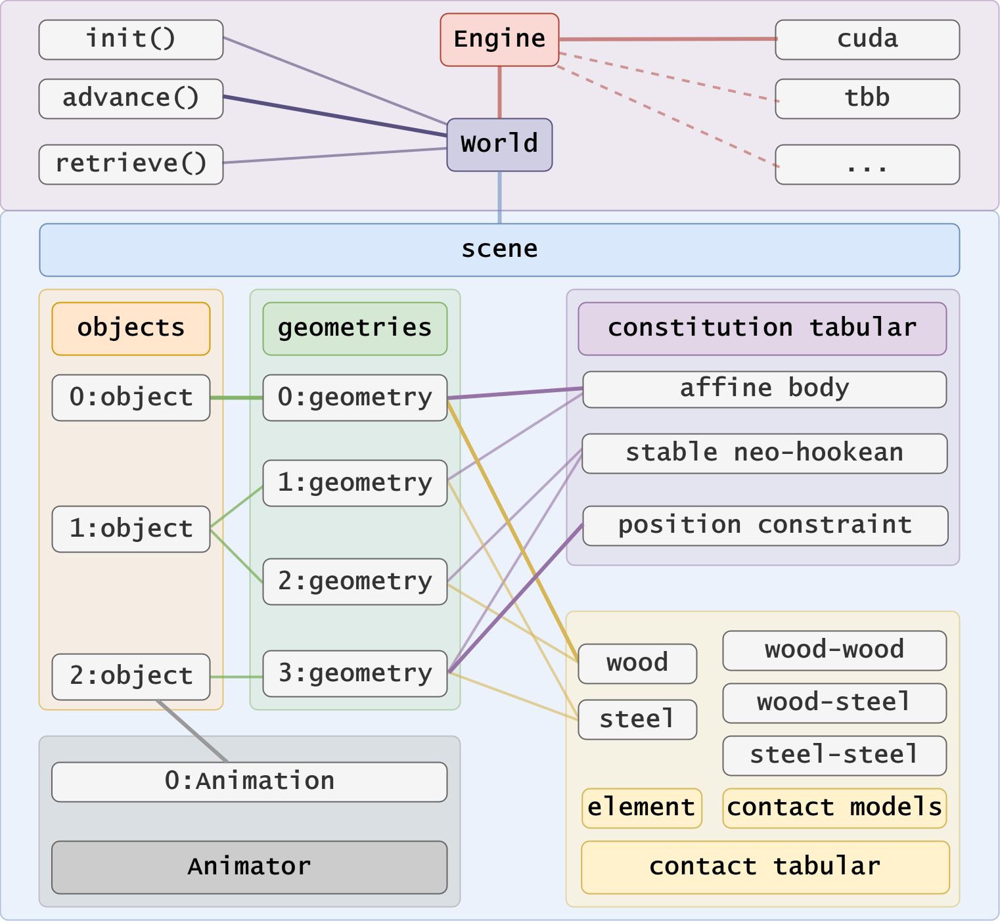

# libuipc


A Cross-Platform Modern C++20 **Lib**rary of **U**nified **I**ncremental **P**otential **C**ontact.

Both **<font color=red>C++</font>** and **<font color=red>Python</font>** APIs are provided!


## Introduction

**Libuipc** provides a unified **GPU** incremental potential contact framework for rigid bodies, soft bodies, cloth, rods, and their couplings. Its frictional contact pipeline targets non-penetration from valid initial geometry through successful collision and solve steps; this is not a guarantee for invalid inputs or failed solves. Forward simulation is the primary supported workflow. Differentiable-simulation APIs exist for selected paths, while broad backward-simulation coverage remains under development.

We are **actively** developing Libuipc and will continue to add more features and improve its performance. We welcome any feedback and contributions from the community!

## Why Libuipc

- **Easy & Powerful**: Libuipc offers an intuitive and unified approach to creating and accessing vivid simulation scenes, supporting a variety of objects and constraints that can be easily added.
- **GPU Simulation**: Contact, constitutions and linear algebra run on the GPU, with host-side orchestration and convergence checks. Solver settings and validation status matter for accuracy and robustness.
- **High Flexibility**: Libuipc provides APIs in both Python and C++ and supports both Linux and Windows systems.
- **Differentiable Simulation Roadmap**: Selected APIs are available; complete model and contact coverage is not yet a supported guarantee.

<table>
  <tr>
    <td>
      
    </td>
    <td>
      
    </td>
  </tr>
</table>

## Key Features

- Finite Element-Based Deformable Simulation
- Rigid & Soft Body Strong Coupling Simulation
- Penetration-Free & Accurate Frictional Contact Handling
- User Scriptable Animation Control
- Differentiable Simulation APIs (partial coverage; under development)

## Document Guidance

- [Build & Install](./build_install/index.md): Instructions to build and install Libuipc on different platforms.
- [Tutorial](./tutorial/index.md): Learn the basic concepts and how to use Libuipc step by step.
- [Specification](./specification/index.md): Detailed definition and explanation of the design and behaviour of Libuipc.

## Citation

If you use **Libuipc** in your project, please cite our works:

```
@article{stiffgipc2025,
      author = {Huang, Kemeng and Lu, Xinyu and Lin, Huancheng and Komura, Taku and Li, Minchen},
      title = {StiffGIPC: Advancing GPU IPC for Stiff Affine-Deformable Simulation},
      year = {2025},
      publisher = {Association for Computing Machinery},
      volume = {44},
      number = {3},
      issn = {0730-0301},
      doi = {10.1145/3735126},
      journal = {ACM Trans. Graph.},
      month = may,
      articleno = {31},
      numpages = {20}
}
```

```
@article{gipc2024,
      author = {Huang, Kemeng and Chitalu, Floyd M. and Lin, Huancheng and Komura, Taku},
      title = {GIPC: Fast and Stable Gauss-Newton Optimization of IPC Barrier Energy},
      year = {2024},
      publisher = {Association for Computing Machinery},
      volume = {43},
      number = {2},
      issn = {0730-0301},
      doi = {10.1145/3643028},
      journal = {ACM Trans. Graph.},
      month = {mar},
      articleno = {23},
      numpages = {18}
}
```
