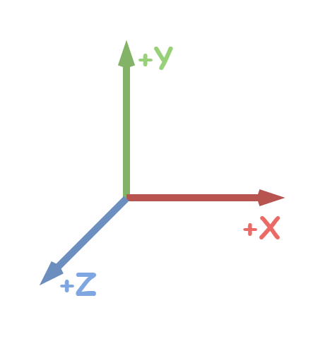
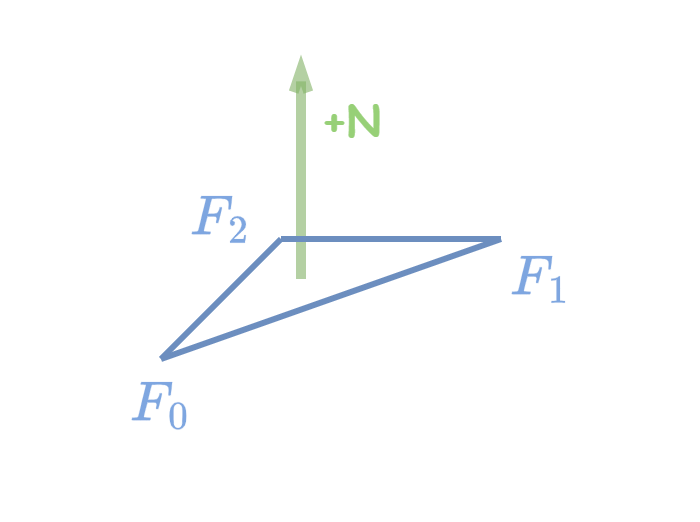
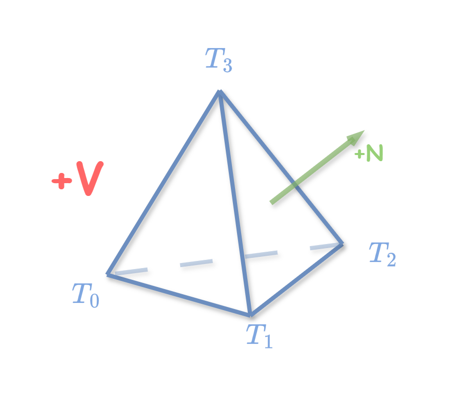

# Libuipc Specification

This document, referred to as the "Libuipc Specification" defines the behavior of the library.

## Coordinates

The `libuipc` uses 3D coordinates to represent points in space. The coordinates are represented as a tuple of three real numbers `(x, y, z)` with units in meters. The convention used is the right-handed coordinate system.

Although the `libuipc` itself does not depend on the specific meaning of the `XYZ` axes, during development and samples creation, we prefer the following conventions:

- The positive X-axis points rightward
- The positive Y-axis points upward
- The positive Z-axis points backward

<p align="center">
    
</p>

Of course you can take the Z-axis as the Up-axis, only changing the gravity direction in the scene configuration.

## Unit System

The `libuipc` uses the International System of Units (SI) for all measurements. The base units used in the library are as follows:

- Length: meters ($m$)
- Mass: kilograms ($kg$)
- Time: seconds ($s$)

Other units are derived from these base units. For example, velocity is measured in meters per second ($m/s$), and force is measured in Newtons ($N$), where $1N = 1kg \cdot m/s^2$.

## Geometry Orientation

In `libuipc`, the orientation of geometric primitives such as triangles and tetrahedra is crucial for physics quantity calculations, e.g. volume, mass, inertia, etc.

### Triangle Orientation

In `libuipc`:

- Open or closed triangle meshes(trimesh) can describe shell-like structures, such as cloth, paper, etc.
- Closed triangle meshes can describe the surface of affine bodies. `libuipc` uses Green's theorem to compute volumetric information.
- The normal direction of a triangle in a mesh is determined by the triangle's topology index (`topo:<Vector3i>` attribute on triangles).

The right-hand rule (counterclockwise winding) determines the direction of the triangle's normal vector. This is consistent with the `.obj` format for triangle meshes and is the most common convention.

The abbreviation `F` for triangle indices stands for "Face", to distinguish it from "Tetrahedron".

<p align="center">
    
</p>

The direction of the triangle normal directly affects the application of Green's theorem. If the imported model produces unexpected simulation results, you may need to check whether the input triangle mesh is correct.

Additionally, `libuipc` allows manual specification of triangle normal directions using the `orient:<IndexT>` attribute on triangles. You can invert the normal of a triangle by setting its `orient` value to `-1`.

```python
from uipc import view
from uipc import builtin
orient = geo.triangles().find(builtin.orient)
view(orient)[:] = -1  # invert all normal directions
```

### Tetrahedron Orientation

In `libuipc`, tetrahedral meshes(tetmesh) can describe affine bodies and soft bodies.

The volume of a tetrahedron is determined by its topology index (`topo:<Vector4i>` attribute on tetrahedra), the formula is as follows:

$$
V=\frac{1}{6}(T_1-T_0)\times(T_2-T_0)\cdot(T_3-T_0)
$$

The surface direction of a positive volume tetrahedron is always outward.

<p align="center">
    
</p>

## Contact Tabular

The contact behaviour of two contact element is defined by the tuple $C = (\kappa, \mu, f)$, where $\kappa \in (0, +\infty)$ is the restitution coefficient, $\mu \in [0,1]$ is the friction coefficient, and $f \in \{0,1\}$ is the enable flag. If $f=1$, the two contact elements are allowed to contact with each other, otherwise not.

$C$ is called a **Contact Model**.

The contact tabular is a matrix-like structure $C_{ij}$.

The users create contact elements by:

=== "C++"

    ```cpp
    auto& contact_tabular = scene.contact_tabular();
    auto& ce1 = contact_tabular.create("#1");
    auto& ce2 = contact_tabular.create("#2"); 
    ```

=== "Python"

    ```python
    contact_tabular = scene.contact_tabular()
    ce1 = contact_tabular.create("#1")
    ce2 = contact_tabular.create("#2")
    ```

and create contact model by:

=== "C++"

    ```cpp
    contact_tabular.insert(ce1, ce2, 0.5, 1.0_GPa, true);
    ```

=== "Python"

    ```python
    contact_tabular.insert(ce1, ce2, 0.5, 1.0 * GPa, True)
    ```

### Default Rule

1. If $C_{ij}$ is not defined(`insert()`) before simulation, the simulator regards $C_{ij} = C_{00}$
2. Default model $C_{00}$ is always defined, users are allowed to modify the default model by:

    === "C++"
    
        ```cpp
        contact_tabular.default_model(0.5, 1.0_GPa, true);
        ```
    
    === "Python"
    
        ```python
        contact_tabular.default_model(0.5, 1.0 * GPa, True)
        ```

## Subscene Tabular

The inter-subscene behaviour of two subscenes is defined by the tuple $S = (f)$, where $f \in \{0,1\}$ is the enable flag, if $f=1$, the objects in subscenes $S_i$ and $S_j$ are allowed to interact, otherwise not.

$S$ is called a **Subscene Model**.

The subscene tabular is a matrix-like structure $S_{ij}$.

The users create subscenes by:

=== "C++"

    ```cpp
    auto& subscene_tabular = scene.subscene_tabular();
    auto& ss1 = subscene_tabular.create("#1");
    auto& ss2 = subscene_tabular.create("#2"); 
    ```

=== "Python"

    ```python
    subscene_tabular = scene.subscene_tabular()
    ss1 = subscene_tabular.create("#1")
    ss2 = subscene_tabular.create("#2")
    ```

and create subscene model by:

=== "C++"

    ```cpp
    subscene_tabular.insert(ss1, ss2, true);
    ```
=== "Python"

    ```python
    subscene_tabular.insert(ss1, ss2, True)
    ```

### Default Rule

1. If $S_{ij} = (f_{ij})$ is not defined(`insert()`) before simulation, the simulator regards:
    $$
    \begin{aligned}\notag
    f_{ij} = 
        \begin{cases}
        1, & \text{if } i=j \newline
        0, & \text{if } i \neq j
        \end{cases}
    \end{aligned}
    $$
2. Default model $S_{00}$ is always defined, users are allowed to modify the default model by:

    === "C++"

        ```cpp
        subscene_tabular.default_model(true);
        ```
    === "Python"
     
        ```python
        subscene_tabular.default_model(True)
        ```

Note that the default rule 1 is different from the contact tabular, because normally objects in the same subscene are allowed to interact, while objects in different subscenes are not, the matrix of $S_{ij}$ most of time looks like an identity matrix. We make the most common case as the default rule to reduce the burden of users.